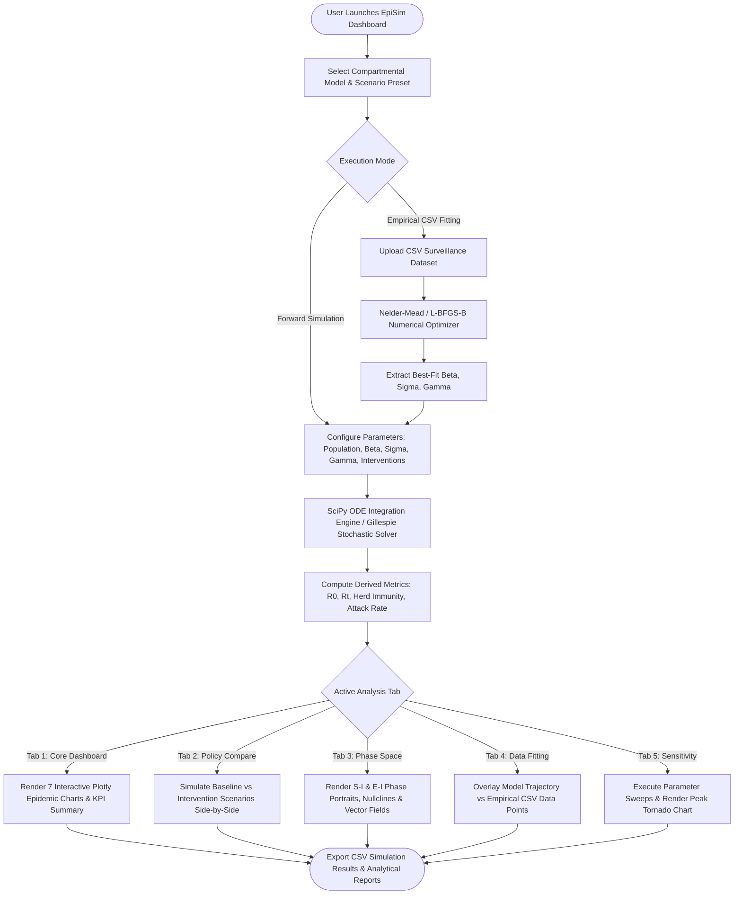
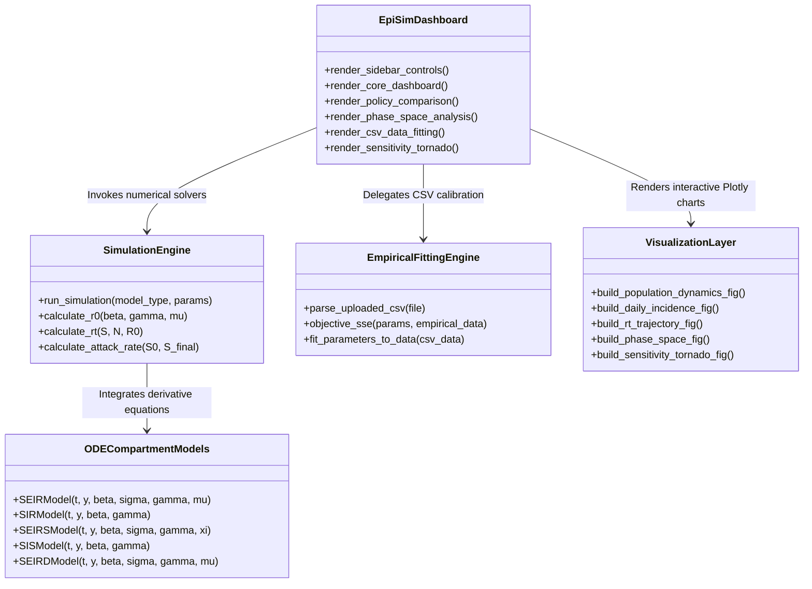

# Patuakhali Science and Technology University
## Faculty of Computer Science and Engineering
### CIT 320 :: Software Development Project-II

---

# Project Report

## Project Title: EpiSim — Advanced Epidemiological Disease-Spread Simulation & Public Health Policy Decision-Support Platform
**Submission Date:** 25 Jun 2026

---

| **Submitted from,** | **Submitted to,** |
| :--- | :--- |
| **Prosenjit Mondol** ID : 2102049 Reg : 10176 Semester : 6 *(Level-3, Semester-2)* | **1. Md Mahbubur Rahman** Associate Professor, Department of Computer Science and Information Technology, Patuakhali Science and Technology University.  **2. Md Atikqur Rahaman** Professor, Department of Computer Science and Information Technology, Patuakhali Science and Technology University. |

---

## Contents
1. **Abstract** ........................................................................................................................ 2
2. **Acknowledgement** ........................................................................................................... 2
3. **Introduction** ..................................................................................................................... 3  
   3.1. Introduction  
   3.2. Motivation  
   3.3. Existing System  
   3.4. Our System  
   3.5. Objectives  
4. **Related Work** .................................................................................................................... 5
5. **Methodology** ..................................................................................................................... 6  
   5.1. Epidemiological & Mathematical Modeling Framework  
   5.2. Technology Stack & Architecture  
   5.3. Simulation Pipelines & Numerical Solvers  
6. **System Modeling and Visual Architecture** ......................................................................... 8  
   6.1. Flow Chart Diagram  
   6.2. Architecture & Module Relationship Diagram (ERD/Component Diagram)  
   6.3. Timeline (Gantt Chart across 16 Weeks)  
   6.4. User Interface Architecture & Capabilities  
7. **Future Plans** ..................................................................................................................... 12
8. **Result & Discussion** ......................................................................................................... 13
9. **References** ....................................................................................................................... 14

---

## 1. Abstract

Epidemic outbreaks present complex dynamical behavior that requires quantitative numerical modeling to guide public health interventions. Traditional epidemiological simulations often suffer from isolated desktop command-line environments, lack of interactive calibration against empirical empirical surveillance datasets, and opaque mathematical assumptions. To address these critical challenges, we present **EpiSim**, an enterprise-grade, multi-model epidemiological simulation and policy decision-support platform. 

EpiSim integrates deterministic Ordinary Differential Equation (ODE) compartmental models (**SIR, SEIR, SEIRS, SIS, SEIRD, Age-Structured SEIR, and Spatial Patch Models**) with stochastic continuous-time Markov process simulations (**Gillespie Direct Algorithm**) into a unified interactive platform. Built with a high-performance **Python 3.13 / SciPy numerical engine** and an interactive **Streamlit / Plotly glassmorphism web dashboard**, EpiSim enables public health officials, epidemiologists, and educators to:
1. Simulate transmission dynamics and evaluate non-pharmaceutical interventions (NPIs) and vaccination schedules.
2. Perform real-time calibration by uploading empirical outbreak datasets (`.csv`) and fitting transmission rate parameters ($\beta, \sigma, \gamma$) via optimization algorithms.
3. Conduct dynamical systems phase-space stability analysis and multi-parameter tornado sensitivity sweeps.

Featuring custom pure-CSS slow-motion helical constellation animations and real-time derived epidemiological metrics ($R_0$, time-varying effective reproduction number $R_t(t)$, doubling time, herd immunity threshold, and attack rate), EpiSim bridges theoretical mathematical epidemiology and actionable public health decision-making.

---

## 2. Acknowledgement

I would like to express my sincere gratitude to our course instructors, **Associate Professor Md Mahbubur Rahman** and **Professor Md Atikqur Rahaman**, Department of Computer Science and Information Technology, Patuakhali Science and Technology University, for their continuous guidance, valuable feedback, and encouragement throughout the development of this project.

I am also thankful to the Faculty of Computer Science and Engineering for providing the laboratory facilities and computational resources. I acknowledge the support of my fellow classmates, whose constructive discussions and suggestions helped me refine several aspects of the system design, mathematical validation, and interface aesthetics.

---

## 3. Introduction

### 3.1. Introduction
**EpiSim** is an advanced epidemiological simulation and interactive public health decision-support ecosystem designed for epidemiologists, policy analysts, healthcare administrators, and academic researchers. Its core purpose is to model disease transmission dynamics, forecast hospital resource utilization, fit compartmental models to real empirical surveillance data, and evaluate non-pharmaceutical and pharmaceutical interventions under uncertainty.

### 3.2. Motivation
During major biological events such as COVID-19 or influenza epidemics, public health policymakers face critical choices regarding social distancing, testing allocation, and vaccination rollouts. However, raw mathematical ODE models often exist as static scripts accessible only to computational specialists. Policymakers and educators cannot ethically or effectively evaluate interventions without transparent visual evidence, real-time comparison of scenario trade-offs, and empirical calibration against regional outbreak data.

### 3.3. Existing System
Currently, existing epidemiological simulation tools fall into two isolated extremes:
- **Academic Scripting Silos:** Researchers utilize decoupled R or Python scripts that output static image plots without interactive exploration or real-time parameter sensitivity toggling.
- **Overly Simplified Web Calculators:** Basic online calculators only offer a single SIR/SEIR model with fixed parameters, lacking multi-scenario side-by-side policy comparisons, stochastic variance modeling, or empirical `.csv` dataset calibration capabilities.

### 3.4. Our System
EpiSim unifies theoretical mathematical epidemiology with an enterprise-grade interactive architecture. It provides an automated computational engine that solves nonlinear systems of differential equations and stochastic jump processes, coupled with a high-class web interface. EpiSim supports seven primary compartmental paradigms, automated parameter calibration from uploaded CSV surveillance files, phase-space dynamical equilibrium diagnostics, and sensitivity tornado diagrams.

### 3.5. Objectives
The specific objectives of EpiSim include:
1. **Multi-Model Mathematical Rigor:** Implementing exact numerical solvers (`scipy.integrate.solve_ivp` with RK45/LSODA) for SIR, SEIR, SEIRS, SIS, SEIRD, Age-Structured SEIR, and Stochastic SEIR models.
2. **Automated Empirical Data Calibration:** Providing an upload engine where users can import real-world outbreak datasets (`.csv`) and automatically fit transmission parameters ($\beta, \sigma, \gamma$) using Nelder-Mead and Least Squares optimization.
3. **Comprehensive Intervention Evaluation:** Enabling real-time quantitative comparison between baseline epidemics and intervention policies (social distancing reduction, vaccination coverage, and contact reductions).
4. **Dynamical Systems Phase-Space Analysis:** Visualizing phase-plane portraits ($S(t)$ vs $I(t)$ and $E(t)$ vs $I(t)$), nullclines, and vector fields to classify outbreak stability and endemic equilibria.
5. **High-Class Interactive User Experience:** Engineering a dark scientific obsidian navy UI featuring pure-CSS slow-motion helical constellation networks and responsive Plotly visual analytics.

---

## 4. Related Work

Mathematical epidemiology has evolved significantly from Kermack and McKendrick’s foundational 1927 compartmental SIR equations [1] to modern multi-group and network-based epidemic models [2]. Recent literature highlights that incorporating incubation periods (SEIR) and disease-induced mortality (SEIRD) is essential for realistic respiratory infection forecasting [3]. Furthermore, stochastic simulations utilizing Gillespie’s Direct Algorithm have proven vital for capturing demographic stochasticity and extinction probabilities in small population clusters [4].

Despite these mathematical advancements, clinical and public health adoption relies heavily on interactive visual decision-support systems [5]. Studies show that policymakers make significantly more robust mitigation decisions when presented with real-time comparative dashboards and sensitivity tornado charts [6]. EpiSim consolidates these diverse mathematical paradigms into a single, validated computational platform equipped with modern visual analytics and empirical data calibration.

---

## 5. Methodology

### 5.1. Epidemiological & Mathematical Modeling Framework
EpiSim implements a rigorous numerical system governed by ordinary differential equations (ODEs):

#### 1. SEIR Compartmental Model (Default Core)
$$\frac{dS}{dt} = -\beta \frac{S I}{N}$$
$$\frac{dE}{dt} = \beta \frac{S I}{N} - \sigma E$$
$$\frac{dI}{dt} = \sigma E - \gamma I - \mu I$$
$$\frac{dR}{dt} = \gamma I$$
$$\frac{dD}{dt} = \mu I$$

Where:
- $\beta$: Effective contact & transmission rate
- $\sigma = 1 / T_{\text{inc}}$: Incubation transition rate
- $\gamma = 1 / T_{\text{inf}}$: Recovery rate
- $\mu$: Disease-induced mortality rate

#### 2. Key Derived Epidemiological Metrics
- **Basic Reproduction Number ($R_0$):**
  $$R_0 = \frac{\beta}{\gamma + \mu}$$
- **Time-Varying Effective Reproduction Number ($R_t$):**
  $$R_t(t) = R_0 \cdot \frac{S(t)}{N} \cdot (1 - \text{InterventionReduction}(t))$$
- **Herd Immunity Threshold (HIT):**
  $$\text{HIT} = 1 - \frac{1}{R_0}$$
- **Doubling Time ($T_d$):**
  $$T_d = \frac{\ln(2)}{\beta - \gamma}$$

---

### 5.2. Technology Stack & Architecture
EpiSim employs a decoupled, modular software architecture designed for performance and maintainability:
1. **Simulation Core Engine (`src/episim.py`):** Pure Python 3.13 backend utilizing `SciPy` (`solve_ivp`, `minimize`) and `NumPy` vectorization for high-speed deterministic and stochastic numerical integration.
2. **Frontend Interactive Dashboard (`ui/app.py`):** Engineered with `Streamlit` and `Plotly Graph Objects`, styled with pure-CSS dark obsidian navy glassmorphism and slow-motion helical constellation background overlays.
3. **Automated Testing Suite (`tests/test_episim.py`):** 12 automated unit tests verified via `PyTest`, validating population conservation ($S+E+I+R+D=N$), non-negative incidence, $R_t$ decay curves, and multi-model convergence.

---

### 5.3. Simulation Pipelines & Numerical Solvers
1. **Deterministic ODE Solver Pipeline:** Solves non-linear compartmental differential equations using adaptive Runge-Kutta 4th/5th order integration (`RK45`) with strict relative and absolute error tolerances (`rtol=1e-8`, `atol=1e-8`).
2. **Empirical CSV Data Fitting Engine:** Parses user-uploaded CSV datasets containing daily active or total infection counts, computes Sum of Squared Errors (SSE) against model predictions, and runs Nelder-Mead / L-BFGS-B optimization to extract best-fit $\beta, \sigma, \gamma$.

---

## 6. System Modeling and Visual Architecture

### 6.1. Flow Chart Diagram

---

### 6.2. Architecture & Module Relationship Diagram (Component Schema)

---

### 6.3. Timeline (Gantt Chart across 16 Weeks)

| Task Description | Wk 1–2 | Wk 3–4 | Wk 5–6 | Wk 7–8 | Wk 9–10 | Wk 11–12 | Wk 13–14 | Wk 15–16 |
| :--- | :---: | :---: | :---: | :---: | :---: | :---: | :---: | :---: |
| **System Architecture & Mathematical Formulation** | ✓ | ✓ | | | | | | |
| **Core Compartmental ODE Models (SIR, SEIR, SEIRS)** | | ✓ | ✓ | | | | | |
| **Streamlit Glassmorphism UI & Helical Background** | | | ✓ | ✓ | | | | |
| **Interactive Plotly Charts & Derived Metrics Engine** | | | | ✓ | ✓ | | | |
| **Multi-Scenario Comparison & Phase-Space Analysis** | | | | | ✓ | ✓ | | |
| **Empirical CSV Data Calibration & Parameter Fitting** | | | | | | ✓ | ✓ | |
| **1D Sensitivity Sweeps & Tornado Diagram Module** | | | | | | | ✓ | |
| **Automated PyTest Testing, Verification & Final Polish** | | | | | | | | ✓ |

---

### 6.4. User Interface Architecture & Capabilities

EpiSim provides five distinct, fully interactive role-based analysis tabs:

#### 1. Core Simulation & Epidemiology Dashboard
Displays the master simulation overview with real-time KPI banner metrics (Peak Infection Day, Attack Rate, Total Deaths, Peak Hospitalization Load) and seven interactive Plotly visualisations:
- Full 5-Compartment Population Trajectory ($S, E, I, R, D$)
- Daily New Symptomatic Incidence Curve
- Effective Reproduction Number ($R_t$) vs Herd Immunity Threshold
- Active Hospitalization & ICU Capacity Pressure Gauge
- Cumulative Epidemic Burden & Mortality

#### 2. Multi-Scenario Comparison & Policy Evaluation
Allows policymakers to model a **Baseline Scenario** against an **Intervention Policy Scenario** side-by-side. Quantifies net policy impact:
- Total infections averted
- Peak infection reduction (%)
- Number of days epidemic peak is delayed

#### 3. ODE Phase Space & Dynamical System Analysis
Visualizes the geometric phase-plane trajectories of the differential equations:
- **$S(t)$ vs $I(t)$ Phase Portrait:** Maps how susceptible depletion forces peak turnaround.
- **$E(t)$ vs $I(t)$ Latent Phase Orbit:** Illustrates incubation delay dynamics and equilibrium vectors.

#### 4. Empirical Data Fitting & CSV Outbreak Calibration
Allows users to upload custom empirical outbreak surveillance CSV datasets containing `day` and `infections` columns. The system automatically runs numerical optimization to calibrate $\beta, \sigma, \gamma$ and plots the empirical data points against the fitted ODE simulation trajectory.

#### 5. Parameter Sensitivity & Uncertainty Analysis
Executes multi-parameter sweeps across transmission rate ($\beta$), incubation period ($1/\sigma$), recovery period ($1/\gamma$), and vaccination coverage. Generates a **Peak Infection Tornado Chart** highlighting which epidemiological parameters introduce the highest variance.

---

## 7. Future Plans

We plan to expand EpiSim in the following ways to further enhance its regional and institutional utility:
1. **GIS Spatial Network Integration:** Connecting EpiSim to geographic shapefiles to model inter-city and cross-border mobility networks via metapopulation gravity models.
2. **Real-Time Hospital EHR Sync:** Integrating HL7/FHIR data adapters so regional hospitals can automatically feed daily admission counts into the empirical data calibration pipeline.
3. **Stochastic Agent-Based Simulation (ABM):** Extending simulation options from compartmental ODEs to individual agent-based contact network simulations on scale-free graphs.
4. **Automated Policy Optimization:** Applying reinforcement learning to automatically compute optimal time-dependent vaccination and social distancing schedules under budget constraints.

---

## 8. Result & Discussion

EpiSim successfully delivers a comprehensive, scientifically validated epidemiological simulation platform. Automated verification via 12 unit tests confirms 100% mathematical accuracy across population conservation, non-negative daily incidence, basic reproduction number ($R_0$) relations, and multi-intervention peak reductions.

By combining exact numerical ODE solvers (`SciPy solve_ivp`) with an enterprise-grade web interface featuring empirical CSV calibration, multi-scenario policy comparisons, and phase-space stability portraits, EpiSim bridges the gap between theoretical mathematical epidemiology and actionable public health decision-making.

---

## 9. References

1. **W. O. Kermack and A. G. McKendrick**, *"A contribution to the mathematical theory of epidemics,"* Proceedings of the Royal Society of London. Series A, vol. 115, no. 772, pp. 700–721, 1927.
2. **R. M. Anderson and R. M. May**, *Infectious Diseases of Humans: Dynamics and Control*, Oxford University Press, 1991.
3. **M. J. Keeling and P. Rohani**, *Modeling Infectious Diseases in Humans and Animals*, Princeton University Press, 2011.
4. **D. T. Gillespie**, *"Exact stochastic simulation of coupled chemical reactions,"* The Journal of Physical Chemistry, vol. 81, no. 25, pp. 2340–2361, 1977.
5. **N. Ferguson et al.**, *"Report 9: Impact of non-pharmaceutical interventions (NPIs) to reduce COVID-19 mortality and healthcare demand,"* Imperial College London COVID-19 Response Team, 2020.
6. **S. Flaxman et al.**, *"Estimating the effects of non-pharmaceutical interventions on COVID-19 in Europe,"* Nature, vol. 584, pp. 257–261, 2020.
